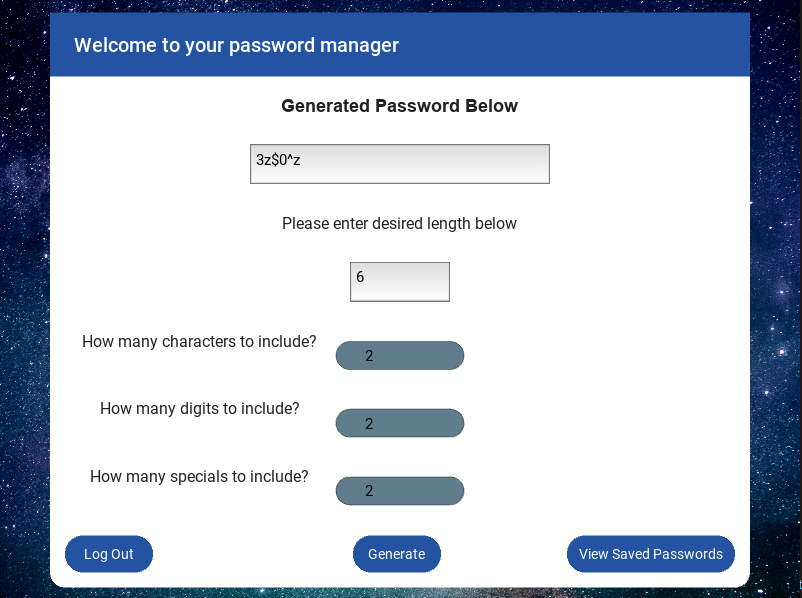

# KivyPassword
 <pre>
  A password generator using both Kivy framework and SQL in order to create a local database for users to generate strong passwords and store them
  
  Using this project as an oppertunity to learn about topics such as GUI's, Databases, and encryption
    Tasks:
      1. Create basic python file to generate random passwords ✓
      2. Practice with kivy and make fake landing pages ✓
      3. Create a basic framework for splash page, log in, account creation, and main page for generator ✓
      4. Integration of framework with python password generator function(In Progress)
      5. Integration of database to ensure user has access to their own entries (Future)
      6. Encrypt these entries or encrypt entire database to ensure security and privacy (Future)
      7. Make the app look more eye friendly (Future)
      
   After all these tasks have been completed this project will be considered finished
    see right side of task to measure progress of overall project
   </pre>

             
