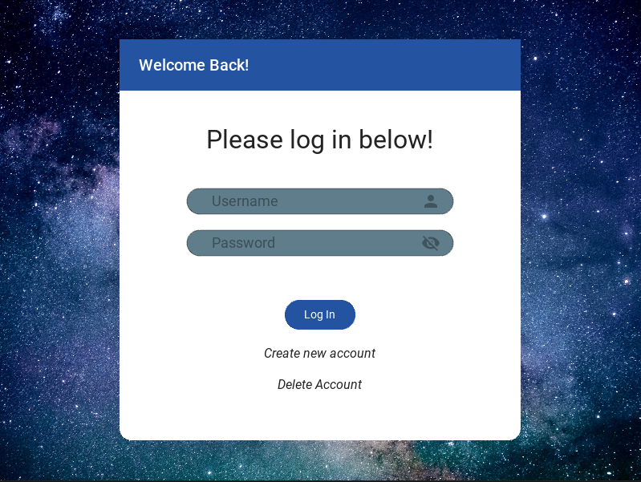

# KivyPassword
  A Password generator created using Kivy/KivyMD to create a graphical user interface. Features log in functionality where user credentials are encrypted by Keyring and stored in local Window Credentials Vault, as well as page to generate passwords and view saved passwords
  
  
  # Why do this?
  I worked on this project during the winter break from school where I was motivated to learn new languages and transport my resultant code beyond the terminal. I was tired of developing applications that were solely interacted with via the terminal command line. So, I decided to learn the library Kivy and its styling langauge to utilize a graphical user interface for my password generator application. In doing this project I learned a lot about both front end and backend work within a python application
  
  This project sparked a massive interest for GUI's within me as well as utilizing python as a programming language for future projects
  #
  <pre>
  Dependencies:
      - Python
      - Kivy
      - KivyMD
      - Keyring
      
      
  Using this project as an oppertunity to learn about topics such as GUI's, Databases, and encryption
    Tasks:
      1. Create basic python file to generate random passwords ✓
      2. Practice with Kivy and make fake landing pages ✓
      3. Create a basic framework for splash page, log in, account creation, and main page for generator ✓
      4. Integration of Kivy framework with python password generator function ✓
      5. Ensure create account and log in screens are functioning with some level of encryption ✓
           Note: Make this stronger possibly with database usage and encrypting entries (Future)
      6. Integration of database into application to track users, and entries better (Future)
      7. Make the app look more eye friendly (Future)
      
   After all these tasks have been completed this project will be considered finished
    see right side of task to measure progress of overall project
   </pre>

                    
