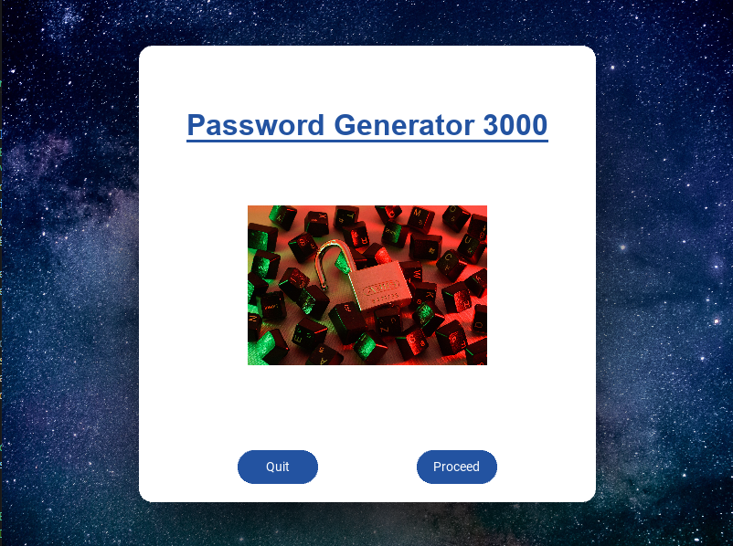
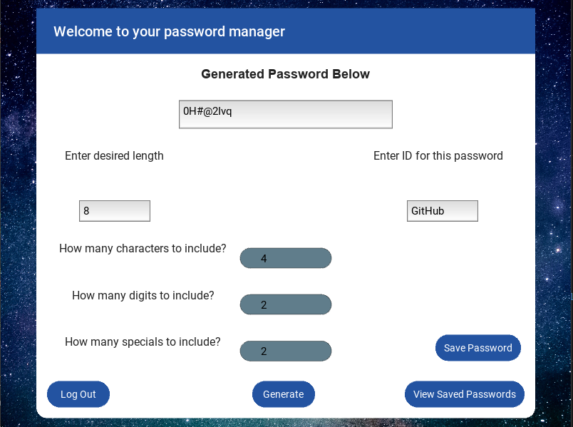
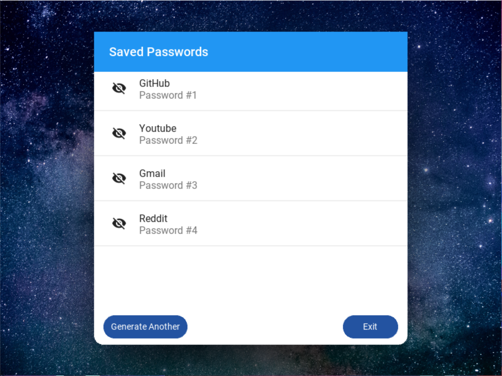

# KivyPassword
 <pre>
  A password generator using both Kivy framework and SQL in order to create a local database for users to generate strong passwords and store them
  
  
  
  Dependencies:
      - Python
      - Kivy
      - KivyMD
      - Keyring
      
      
  Using this project as an oppertunity to learn about topics such as GUI's, Databases, and encryption
    Tasks:
      1. Create basic python file to generate random passwords ✓
      2. Practice with Kivy and make fake landing pages ✓
      3. Create a basic framework for splash page, log in, account creation, and main page for generator ✓
      4. Integration of Kivy framework with python password generator function ✓
      5. Ensure create account and log in screens are functioning with some level of encryption ✓
           Note: Make this stronger possibly with database usage and encrypting entries (Future)
      6. Integration of database into application to track users, and entries better (Future)
      7. Make the app look more eye friendly (Future)
      
   After all these tasks have been completed this project will be considered finished
    see right side of task to measure progress of overall project
   </pre>

                    
